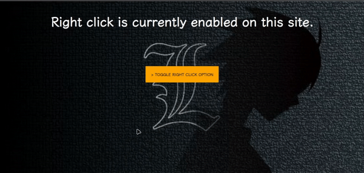

An easy front-end solution for disabling right-click & f12 key functionality on web pages.

## Checkout

Check live from here =>

[https://iamovi.github.io/disabled_click/](https://iamovi.github.io/disabled_click/)

## Installation

### Using CDN

```html
<!-- disabled_click CDN -->

<link rel="stylesheet" href="https://iamovi.github.io/disabled_click/dist/v1_17-03-2024/click_box.css">

<script src="https://iamovi.github.io/disabled_click/dist/v1_17-03-2024/v2_disabled-f12/disabled2.js"></script>
```

- add these css and js CDN to your HTML head tag.

Next add =>

```bash
<!-- disabled_right_click -->
<div id="disabled_click"></div>
```

- this to HTML Body.

## Quick start
  
  ```html
<!DOCTYPE html>
<html lang="en">
  <head>
    <meta charset="UTF-8" />
    <meta name="viewport" content="width=device-width, initial-scale=1.0" />
    <title>Document</title>

    <!-- disabled_click CDN -->

    <link
      rel="stylesheet"
      href="https://iamovi.github.io/disabled_click/dist/v1_17-03-2024/click_box.css"
    />

    <script src="https://iamovi.github.io/disabled_click/dist/v1_17-03-2024/v2_disabled-f12/disabled2.js"></script>
  </head>
  <body>
    <h1 style="text-align: center">Hello World!</h1>

    <!-- disabled_right_click -->
    <div id="disabled_click"></div>
  </body>
</html>
```

## LICENSE

[MIT](LICENSE)