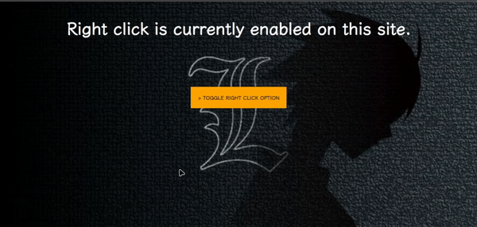

An easy front-end solution for disabling right-click functionality on web pages. 

## Installation

### Using CDN

```bash
cdn...
cdn script...
```

Next add =>

```bash
<!-- disabled_cursor_right -->
<div id="disabled_click">Right-clicking is discouraged.</div>
```

- this to HTML Body.

### Without CDN (optional)

If you prefer not to use CDN, then follow the step by step guide to implement `disabled_right_click` =>

**1 /**

First create a .css file and add these following codes:

```css
#disabled_click {
    display: none;
    position: absolute;
    background-color: #fff;
    border: 1px solid #ccc;
    padding: 10px;
    box-shadow: 2px 2px 5px rgba(0, 0, 0, 0.2);
    z-index: 100;
    user-select: none;
  }
  ```
  
  **2 /**
  
  Then create a .js file and add these following codes:

```javascript
document.addEventListener('contextmenu', function (e) {
    e.preventDefault();

    const x = e.clientX;
    const y = e.clientY;

    const scrollX = window.pageXOffset;
    const scrollY = window.pageYOffset;

    const customMessage = document.getElementById('disabled_click');
    customMessage.style.left = `${x + scrollX}px`;
    customMessage.style.top = `${y + scrollY}px`;
    customMessage.style.display = 'block';

    setTimeout(function () {
      customMessage.style.display = 'none';
    }, 1000);
  });
  ```
  
  **3 /**
  
  Now add these following codes to .html file:
  
  ```html
  <!-- disabled_right_click -->
  <div id="disabled_click">Right-clicking is discouraged.</div>
  ```
  - make sure you link .css and .js file to your .HTML
  
  > and Done.
  
  ## Quick start
  
  ```html
  <!DOCTYPE html>
<html lang="en">
<head>
    <meta charset="UTF-8">
    <meta name="viewport" content="width=device-width, initial-scale=1.0">
    <title>Document</title>
    <link rel="stylesheet" href="./dist/click_box.css">
    <script src="./dist/disabled.js"></script>
</head>
<body>
        <!-- disabled_cursor_right -->
        <div id="disabled_click">Right-clicking is discouraged.</div>
    

</body>
</html>
```